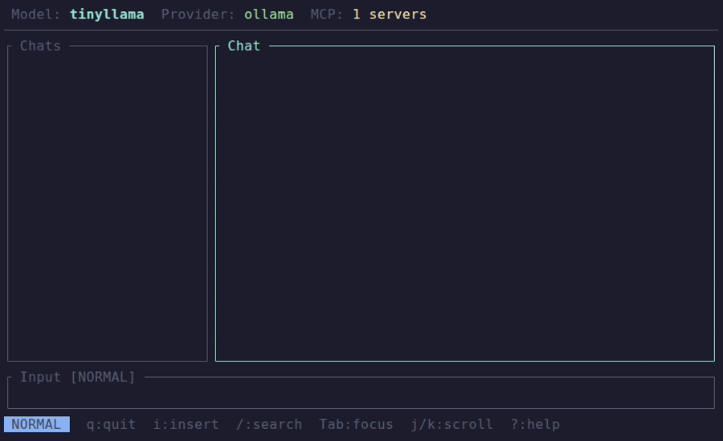

# lazyllm

A fast, keyboard-driven TUI for chatting with LLMs. Inspired by [lazygit](https://github.com/jesseduffield/lazygit) and [lazydocker](https://github.com/jesseduffield/lazydocker).




## Features

- **Multi-provider support** — OpenAI, Anthropic, Ollama, Google Gemini
- **Real-time streaming** — Watch responses appear token by token
- **Vim-like keybindings** — Normal, Insert, Visual, and Command modes
- **Markdown rendering** — Syntax-highlighted code blocks in the terminal
- **Conversation persistence** — Auto-saved to SQLite with full history
- **Context management** — Reusable prompt/context files, budget-aware assembly
- **Token tracking** — Per-turn and cumulative usage with cost calculation
- **Context compaction** — Automatic summarization or truncation for long conversations
- **MCP integration** — External tool use via Model Context Protocol
- **Custom themes** — Full colour customisation via TOML theme files
- **Configurable** — TOML config with sensible defaults
- **Fast** — Built in Rust with async I/O

## Documentation

| Document | Description |
|----------|-------------|
| [Architecture](docs/architecture.md) | Provider system, streaming, MCP, app structure |
| [Context Management](docs/context.md) | Context assembly, compaction, token tracking, pricing |
| [Data Storage](docs/storage.md) | SQLite schema, migrations, persistence lifecycle |
| [UI Reference](docs/ui.md) | Layout, keybindings, commands, themes, and all UI configuration |

## Installation

```bash
git clone https://github.com/yourusername/lazyllm.git
cd lazyllm
cargo build --release
```

The binary will be at `target/release/lazyllm`.

## Quick Start

1. Set your API key:

```bash
export OPENAI_API_KEY="sk-..."
```

2. Create a config file at `~/.config/lazyllm/config.toml`:


```toml
[general]
default_provider = "openai"
default_model = "gpt-4o"

[providers.openai]
provider_type = "openai"
api_key_env = "OPENAI_API_KEY"
models = ["gpt-4o", "gpt-4o-mini"]
```

3. Run:

```bash
lazyllm
```

> If no config file exists, lazyllm starts with defaults (OpenAI provider, gpt-4o model).

## Keybindings

### Normal Mode

| Key | Action |
|-----|--------|
| `i` | Enter Insert mode (type messages) |
| `v` | Enter Visual mode |
| `:` | Enter Command mode |
| `q` | Quit |
| `Ctrl+C` | Force quit (works in any mode) |
| `Tab` / `Shift+Tab` | Cycle panel focus |
| `h` / `l` | Focus left / right panel |
| `j` / `k` | Scroll down / up |
| `Enter` | Select conversation |
| `n` | New chat |
| `d` | Delete chat |
| `?` | Toggle help overlay |

### Insert Mode

| Key | Action |
|-----|--------|
| `Esc` | Return to Normal mode |
| `Enter` | Send message |
| `Backspace` | Delete character |
| Any character | Type into input |

### Visual Mode

| Key | Action |
|-----|--------|
| `Esc` | Return to Normal mode |
| `j` / `k` | Scroll down / up |


- **Chat List** (left) — Conversation history sidebar
- **Chat View** (center) — Messages with markdown rendering
- **Tool Panel** (right) — MCP tools
- **Input Box** (bottom) — Press `i` to start typing, `Enter` to send
- **Status Bar** — Current mode and status

## Configuration

Config location: `~/.config/lazyllm/config.toml`

### Full Example

```toml
[general]
default_provider = "openai"
default_model = "gpt-4o"
save_conversations = true
data_dir = "~/.local/share/lazyllm"    # where conversations are stored
system_prompt = "You are a helpful assistant."  # optional global system prompt
# default_context = "rust-dev"         # optional default context file

[ui]
theme = "default"
show_tool_panel = true
show_timestamps = false
sidebar_width = 25
tool_panel_width = 20

[conversation]
compaction_strategy = "auto"           # "auto", "none", "truncation", "summarization"
compaction_threshold = 0.75            # usage fraction that triggers compaction
recent_messages = 20                   # always keep this many recent messages
budget_fraction = 0.80                 # fraction of context window to use

[usage]
show_token_usage = true
show_cost = true
show_context_usage = true
# cost_warning_threshold = 0.50        # per-turn cost warning in USD

[features]
latex_rendering = true
table_rendering = true
search = true
contexts = true
mcp_servers = true

# ── Providers ───────────────────────────────────────────

[providers.openai]
provider_type = "openai"
api_key_env = "OPENAI_API_KEY"
base_url = "https://api.openai.com/v1"           # optional, this is the default
models = ["gpt-4o", "gpt-4o-mini", "gpt-4.1"]

[providers.anthropic]
provider_type = "anthropic"
api_key_env = "ANTHROPIC_API_KEY"
models = ["claude-sonnet-4-20250514", "claude-haiku-4-5-20251001"]

[providers.ollama]
provider_type = "ollama"
base_url = "http://localhost:11434"               # optional, this is the default
models = ["llama3.2", "mistral", "codellama"]

[providers.google]
provider_type = "google"
api_key_env = "GOOGLE_API_KEY"
models = ["gemini-2.0-flash", "gemini-2.5-pro"]

# ── MCP Servers ───────────────────────────────────────

[[mcp.servers]]
name = "filesystem"
command = "npx"
args = ["-y", "@modelcontextprotocol/server-filesystem", "/tmp"]

[[mcp.servers]]
name = "custom"
command = "/usr/bin/my-server"
transport = "sse"
url = "http://localhost:8080/sse"
```

### Provider Setup

#### OpenAI

```bash
export OPENAI_API_KEY="sk-..."
```

```toml
[providers.openai]
provider_type = "openai"
api_key_env = "OPENAI_API_KEY"
models = ["gpt-4o", "gpt-4o-mini"]
```

Any OpenAI-compatible API (Azure, Together, local servers) can use `provider_type = "openai"` with a custom `base_url`.

#### Anthropic

```bash
export ANTHROPIC_API_KEY="sk-ant-..."
```

```toml
[providers.anthropic]
provider_type = "anthropic"
api_key_env = "ANTHROPIC_API_KEY"
models = ["claude-sonnet-4-20250514", "claude-opus-4-1"]
```

#### Ollama (Local)

No API key needed. Just have [Ollama](https://ollama.com) running locally.

```toml
[providers.ollama]
provider_type = "ollama"
base_url = "http://localhost:11434"
models = ["llama3.2", "mistral"]
```

#### Google Gemini

```bash
export GOOGLE_API_KEY="AI..."
```

```toml
[providers.google]
provider_type = "google"
api_key_env = "GOOGLE_API_KEY"
models = ["gemini-2.0-flash", "gemini-2.5-pro"]
```

### Multiple Providers

You can configure as many providers as you want. Set `default_provider` and `default_model` in `[general]` to choose which one lazyllm uses on startup.

Providers without valid API keys are silently skipped at startup (check the log for details).

## Data Storage

| Path | Purpose |
|------|---------|
| `~/.config/lazyllm/config.toml` | Configuration |
| `~/.config/lazyllm/contexts/` | Context files (TOML) |
| `~/.local/share/lazyllm/lazyllm.db` | SQLite database (conversations, messages, checkpoints) |
| `~/.local/share/lazyllm/logs/lazyllm.log` | Debug log |

Conversations are stored in SQLite and auto-saved on every message send and on quit. See [Data Storage](docs/storage.md) for schema details.

## Development

### Build

```bash
cargo build
```

### Run Tests

```bash
cargo test
```

The project has 267+ tests covering all modules.

### Project Structure

```
src/
├── main.rs              # Binary entry point, terminal setup
├── lib.rs               # Library crate (for integration tests)
├── app.rs               # Central state, action dispatch, streaming
├── command.rs           # CLI command parsing (:quit, :model, etc.)
├── conversation.rs      # ConversationManager — persistence coordination
├── config/
│   ├── mod.rs           # Config loading/saving
│   └── types.rs         # AppConfig, ProviderConfig, ConversationConfig, etc.
├── context/
│   ├── mod.rs           # Load context TOML files
│   └── types.rs         # Context, ContextFile
├── event/
│   ├── mod.rs           # Event loop spawning
│   ├── keybindings.rs   # Key → Action mapping
│   └── types.rs         # Action, Mode, FocusTarget enums
├── llm/
│   ├── mod.rs           # LlmProvider trait, ProviderRegistry
│   ├── types.rs         # Message, ChatRequest, StreamChunk, TokenUsage
│   ├── openai.rs        # OpenAI-compatible provider
│   ├── anthropic.rs     # Anthropic Messages API
│   ├── ollama.rs        # Ollama native API
│   ├── google.rs        # Google Gemini API
│   ├── streaming.rs     # SSE stream parsing utilities
│   ├── context.rs       # Budget-aware context assembly
│   ├── compaction.rs    # Context compaction strategies
│   ├── capabilities.rs  # Model context windows and feature flags
│   └── pricing.rs       # Token pricing and cost calculation
├── markdown/
│   ├── mod.rs           # Markdown → TUI rendering
│   ├── latex.rs         # LaTeX to Unicode conversion
│   └── tables.rs        # Table to box-drawing conversion
├── mcp/
│   ├── mod.rs           # Module exports
│   ├── manager.rs       # McpManager — server lifecycle
│   ├── client.rs        # McpClient — single server connection
│   └── types.rs         # ToolInfo and related types
├── store/
│   ├── mod.rs           # Store trait and StoreError
│   ├── types.rs         # Conversation, ConversationSummary, Checkpoint
│   └── sqlite_store.rs  # SQLite persistence backend
└── ui/
    ├── mod.rs           # Layout rendering
    ├── theme.rs         # Theme loading and colour parsing
    └── components/
        ├── mod.rs             # Component trait
        ├── chat_list.rs       # Conversation sidebar
        ├── chat_view.rs       # Message display
        ├── input_box.rs       # Text input
        ├── model_selector.rs  # Provider/model bar
        ├── status_bar.rs      # Mode + status
        ├── tool_panel.rs      # MCP tools panel
        ├── help_overlay.rs    # Keybinding reference
        └── model_popup.rs     # Model/provider selection popup
```

## Roadmap

- [x] TUI skeleton with vim-like navigation
- [x] OpenAI streaming provider
- [x] Markdown rendering with syntax highlighting
- [x] Conversation persistence
- [x] Anthropic, Ollama, Google providers
- [x] Custom themes
- [x] Command mode with `:` commands
- [x] Interactive model/provider switcher
- [x] MCP (Model Context Protocol) integration
- [x] Clipboard copy support
- [x] Search within conversations
- [x] System prompt configuration
- [x] Token usage tracking
- [x] Conversation export
- [ ] Image/multimodal support

## License

MIT
