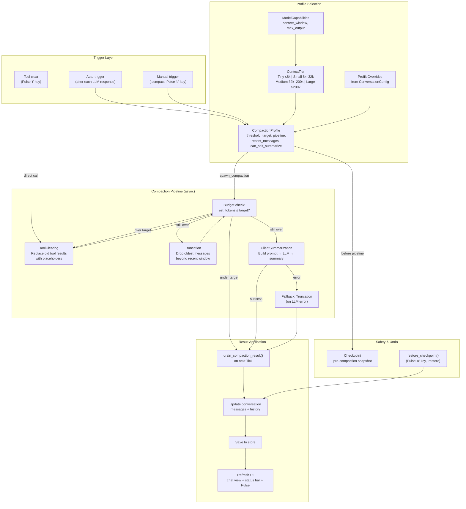
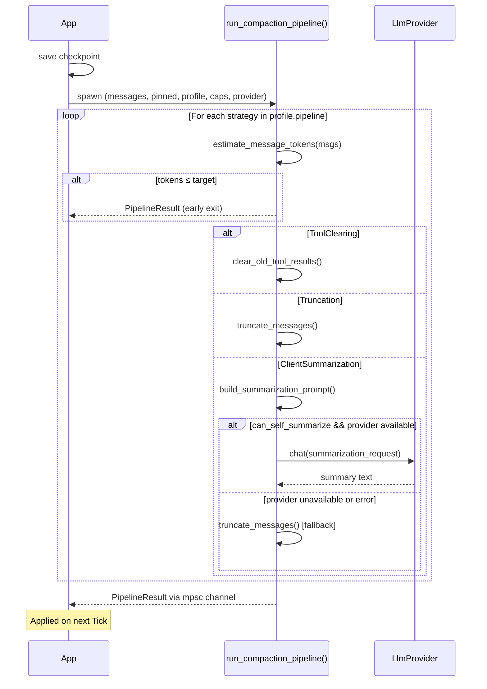
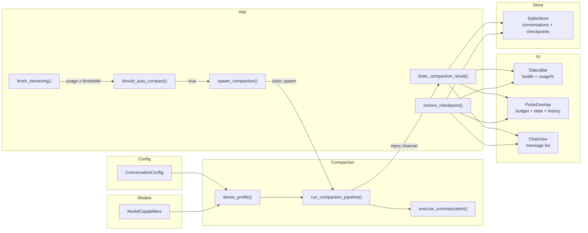

# Compaction & Pulse Overlay

lazyllm manages context pressure through a tiered compaction pipeline that adapts to the model's context window. The Pulse overlay provides real-time visibility into context health, token budgets, and compaction history.

## Architecture



## Compaction Profiles

Profiles are auto-derived from the model's context window size via `derive_profile()`. Each tier has default thresholds, a strategy pipeline, and a recent message count tuned for its capacity.

| Tier | Context Window | Trigger | Target After | Keep Recent | Pipeline | Self-Summarize |
|------|---------------|---------|-------------|-------------|----------|----------------|
| **Tiny** | ≤ 8k | 50% | 20% | 4 | Truncation | No |
| **Small** | 8k – 32k | 60% | 25% | 8 | ToolClearing → Truncation | No |
| **Medium** | 32k – 200k | 70% | 30% | 15 | ToolClearing → Summarization | Yes* |
| **Large** | > 200k | 80% | 40% | 20 | ToolClearing → Truncation → Summarization | Yes* |

\* Ollama models default to `can_self_summarize = false` regardless of tier — local models are not reliable summarizers.

### Override Behavior

User config values override tier defaults when explicitly set (i.e., differ from the `ConversationConfig` defaults). `ProfileOverrides::from_config()` detects non-default values:

```toml
[conversation]
compaction_strategy = "truncation"  # overrides pipeline to [Truncation] only
compaction_threshold = 0.60         # overrides trigger_threshold
recent_messages = 10                # overrides recent_messages
```

Setting `compaction_strategy = "none"` disables the pipeline entirely.

## Compaction Strategies

### Tool Clearing

The cheapest strategy. Replaces old tool result content with `[tool result cleared]`, preserving the message structure. Runs in-place without removing messages.

- Skips the last N tool interactions (where N = `recent_messages`)
- **Pinned messages are never cleared**, even if they contain tool results
- Returns `ClearResult` with `cleared_count` and `tokens_reclaimed`

### Truncation

Removes the oldest messages beyond the recent window. Generates a system-message summary noting how many messages were removed.

- Keeps the N most recent messages intact
- **Pinned messages are pulled forward** into the kept set regardless of their position
- Summary: `"[N earlier messages removed for context management]"`

### Client Summarization

Sends older messages to the LLM to produce a structured summary that replaces them.

The summarization prompt instructs the model to preserve:
1. Code blocks (verbatim, fenced)
2. Key decisions and rationale
3. File paths, variable names, function names, error messages, URLs
4. Current state of work in progress
5. Unresolved questions
6. Constraints or requirements stated by the user

**Pinned messages** are preserved verbatim alongside the recent window. The prompt notes their existence so the summary doesn't duplicate their content.

**Custom instructions** (from `:compact <text>`) are appended as an "Additional focus" section in the prompt.

If summarization fails (LLM error, timeout, empty response), the pipeline **falls back to truncation** automatically.

## Pipeline Execution



### PipelineResult

```rust
pub struct PipelineResult {
    pub messages: Vec<Message>,         // compacted message list
    pub summary: Option<String>,        // summary for context injection
    pub total_removed: usize,           // messages dropped
    pub total_tokens_reclaimed: u32,    // tokens freed (tool clearing)
    pub steps_applied: Vec<CompactionMode>, // strategies that ran
}
```

## Auto-Compaction

After each LLM response completes (`finish_streaming()`), lazyllm checks `should_auto_compact()`:

1. Strategy is not `"none"`
2. No compaction already in flight (`compaction_rx` is `None`)
3. Active conversation exists with more messages than `profile.recent_messages`
4. Estimated usage fraction ≥ `profile.trigger_threshold`

If all conditions are met, `spawn_compaction(None)` fires automatically. The pipeline runs in a background `tokio::spawn` task and results are drained on the next `Action::Tick` (~33ms).

## Checkpoints & Undo

Every compaction saves a **checkpoint** — a JSON snapshot of the full message list — before modifying anything. Checkpoints are stored in the `checkpoints` table (SQLite) or as JSON files (JsonStore).

- Maximum checkpoints per conversation: `max_checkpoints` (default 5)
- Oldest checkpoints are pruned automatically
- Undo restores messages from the latest checkpoint, pops the last `CompactionEvent`, clears `compaction_summary`, and deletes the consumed checkpoint

### Undo Flow

```
Pulse overlay 'u' key → PulseUndoCompaction action
  → restore_checkpoint(None)
    → load latest checkpoint
    → replace conversation messages
    → pop compaction_history entry
    → clear compaction_summary
    → delete consumed checkpoint from store
    → refresh chat view + status bar + Pulse
```

## Pulse Overlay

The Pulse overlay (`P` key or `:pulse`) provides a real-time dashboard for context health and compaction controls.

### Layout

```
┌─────────────────── Pulse ────────────────────┐
│                                              │
│  Context Budget                              │
│  ████████████░░░░░░░░  62% Working           │
│  system: 450  context: 200  tools: 600       │
│  summary: 0   pinned: 180  history: 12400    │
│  free: 8170   total: 22000                   │
│                                              │
│  Session Stats                               │
│  8 turns │ 12.4k in + 3.2k out │ $0.0412     │
│  Cache hit: 34% │ ~$0.005/msg                │
│  2 compactions │ 45 messages dropped         │
│                                              │
│  Pinned Messages                             │
│   #3 [user] Implement the auth middleware    │
│   #7 [assistant] The key constraint is…      │
│                                              │
│  Session Notes                               │
│  Working on auth refactor, legal compliance  │
│                                              │
│  Compaction History                          │
│  03-24 14:32 │ tool clearing │ -12 msgs      │
│  03-24 14:35 │ truncation    │ -8 msgs       │
│                                              │
│  Mode: client                                │
│                                              │
│  [c]ompact [C]ustom [t]ool-clear [u]ndo      │
│  [p]in [n]otes [s]witch-mode [q]uit          │
└──────────────────────────────────────────────┘
```

### Keybindings

| Key | Action | Description |
|-----|--------|-------------|
| `c` | `PulseCompact` | Run compaction pipeline with auto-selected strategy |
| `C` | `PulseCompactWithPrompt` | Switch to command mode with `:compact ` prefilled |
| `t` | `PulseClearToolResults` | Clear old tool results only (immediate, no pipeline) |
| `u` | `PulseUndoCompaction` | Restore from latest checkpoint |
| `p` | `PulseTogglePin` | Pin/unpin the selected message |
| `n` | `PulseEditNotes` | Open session notes editor |
| `s` | `PulseSwitchMode` | Cycle compaction mode: auto → client → server |
| `j`/`k` | Scroll | Scroll the overlay content |
| `q`/`Esc` | Close | Close the Pulse overlay |

### Data Sources

| Section | Source |
|---------|--------|
| Context Budget | `ContextBudget` from `refresh_pulse_data()` — built from `context_estimate` + model capabilities |
| Session Stats | `PulseStats` from `session_usage` + conversation fields |
| Pinned Messages | `PinnedPreview` from `conversation.pinned_messages` indices |
| Session Notes | `conversation.session_notes` |
| Compaction History | `conversation.compaction_history` (last 5 events) |
| Mode | `config.conversation.compaction_mode` |

## Status Bar Health Indicator

The status bar shows a persistent health indicator derived from context usage:

```
[NORMAL] ◉ 62% Working                    ready | 1.2k in + 340 out
```

| Health State | Usage Range | Meaning |
|-------------|-------------|---------|
| **Fresh** | < 30% | Plenty of context room |
| **Working** | 30% – 60% | Normal operation |
| **Warm** | 60% – 75% | Context filling up |
| **Hot** | ≥ 75% | Compaction recommended |

When a compaction summary is active, a `⟳` icon appears to indicate that older context has been compressed.

The health indicator refreshes immediately after compaction and checkpoint restore — not just after the next LLM response.

## Pinned Messages

Messages can be pinned to protect them from compaction. Pinned messages:

- **Tool clearing**: pinned tool results are never replaced
- **Truncation**: pinned messages are pulled forward into the kept set, regardless of age
- **Summarization**: pinned messages are preserved verbatim; the summarization prompt notes their existence to avoid duplicating their content

Pin/unpin via the Pulse overlay (`p` key) or `:pin` command. Pins are stored as message indices in `conversation.pinned_messages` and persisted to the store.

## Data Flow Summary



## Key Files

| File | Purpose |
|------|---------|
| `src/llm/compaction.rs` | All compaction logic: profiles, strategies, pipeline, summarization |
| `src/llm/context.rs` | `assemble_context()`, `ContextBudget`, budget-aware message selection |
| `src/llm/health.rs` | `HealthState` enum (Fresh/Working/Warm/Hot) |
| `src/llm/capabilities.rs` | Per-model context window and feature detection |
| `src/app.rs` | `spawn_compaction()`, `should_auto_compact()`, `drain_compaction_result()`, `restore_checkpoint()`, `refresh_pulse_data()` |
| `src/ui/components/pulse_overlay.rs` | Pulse overlay rendering and key handling |
| `src/ui/components/status_bar.rs` | Health indicator and usage percentage display |
| `src/store/types.rs` | `CompactionEvent`, `CompactionMode`, `Checkpoint` |
| `src/config/types.rs` | `ConversationConfig` compaction settings |
